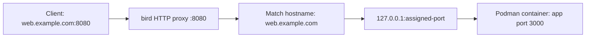

<p align="center">
  
</p>

<h1 align="center">Bird</h1>

<p align="center"><strong>Agent and human friendly containers as a service.</strong></p>

<p align="center">
  <a href="#quick-start">Quick start</a> ·
  <a href="#usage">Usage</a> ·
  <a href="#how-it-works">How it works</a> ·
  <a href="#development">Development</a>
</p>

> [!WARNING]
> **bird is a very, very experimental project.** Expect breaking changes, bugs, and incomplete features. Use it for experimentation with disposable workloads and data, not production deployments.

A self-hostable platform for deploying containerized apps, written in Rust. bird uses Podman to run containers, SQLite to store state, and a built-in HTTP proxy to route traffic to services.

- `birdd`: the daemon, HTTP API, proxy, and machine supervisor.
- `bird`: the CLI for deploying, listing, viewing logs, and removing services.

## Why Rust?

Rust fits a long-running daemon that handles HTTP traffic, container operations, and background supervision. Its ownership and type system help catch memory and concurrency mistakes at compile time, while explicit error handling makes failures easier to manage.

bird uses Tokio for asynchronous I/O and streams requests through the proxy without buffering entire bodies. Rust also compiles the CLI and daemon into native binaries, so running bird does not require installing a language runtime.

## Why Podman?

Podman lets bird run containers as an unprivileged Linux user, which fits a self-hosted setup managed through systemd user services. Its API provides the image pulls, container lifecycle, networking, and logs bird needs, so bird can focus on deployments, routing, and supervision.

bird talks directly to Podman's native HTTP API over a local Unix socket. It requires the Podman API socket to be enabled and uses standard container images from registries such as Docker Hub and GHCR.

## Why SQLite?

SQLite keeps bird's state in a local database without a separate database server, credentials, or service to maintain. That keeps setup small: start `birdd`, and it creates `bird.db` in the data directory and applies migrations automatically.

bird uses transactions and foreign keys to keep related service, deployment, and machine records consistent. Database work runs on a dedicated thread, while the proxy reads an in-memory route table rather than querying SQLite for each request. This fits bird's current single-server setup, where state changes happen during deployments and supervision.

## Why a custom proxy?

Routing is part of the deployment lifecycle: when a new deployment becomes active or a machine is replaced, bird needs to send traffic to the right containers. A built-in proxy lets the daemon update routes directly from its own state, keeping domains, deployments, and machine addresses together without generating configuration for another service.

The proxy streams request and response bodies, reuses upstream connections, and reads an in-memory route table that the daemon can replace without restarting the listener. This keeps the routing path focused on bird's needs and gives a self-hosted installation fewer components to manage.

## Requirements

- Linux with Podman 5 or newer.
- A Rust toolchain supporting edition 2024.
- A running Podman API socket.

Enable the rootless Podman socket:

```sh
systemctl --user enable --now podman.socket
```

## Quick start

Build both binaries from the repository root:

```sh
cargo build --release
```

Start the daemon:

```sh
./target/release/birdd --data-dir ./data --proxy-addr 0.0.0.0:8080
```

With this command, the API listens on `127.0.0.1:7070` and the HTTP proxy on `0.0.0.0:8080`. The daemon creates a database and an API token in `./data`.

In another terminal, log in and deploy an app:

```sh
./target/release/bird login 127.0.0.1:7070 < ./data/api-token
./target/release/bird deploy web docker.io/library/nginx:alpine --domain web.localhost
curl -H 'Host: web.localhost' http://127.0.0.1:8080
```

## Usage

```sh
bird list
bird logs web --tail 100
bird deploy app ghcr.io/owner/app:latest --port 3000 --domain app.example.com -e NODE_ENV=production
bird remove web
```

These commands assume `bird` is on your `PATH`; otherwise use `./target/release/bird`. The container port defaults to `80`. Repeat `--env` or `-e` to set multiple environment variables.

For a custom domain, point DNS at your server and send HTTP traffic to the proxy port. The built-in proxy serves HTTP; configure an external TLS terminator for HTTPS.

Run `bird --help` or `birdd --help` for available options. A rootless systemd user service is provided in [contrib/systemd/birdd.service](contrib/systemd/birdd.service), with installation instructions in its header.

## How it works

### Deployments

`bird` sends authenticated requests to the `birdd` API. When you run `bird deploy`, the daemon:

1. Saves the service image, container port, domains, and environment variables in SQLite.
2. Pulls the image and starts a Podman container on the `bird` network.
3. Publishes the app's container port on a dynamically assigned port on `127.0.0.1`.
4. Waits up to 60 seconds for an HTTP response from the app.
5. Activates the deployment, updates the proxy routes, and removes the previous deployment's containers.

Deploying the same service name replaces its deployment. The previous deployment keeps serving while the new container starts; if startup fails, traffic stays on the previous deployment. The app must listen on `0.0.0.0` inside the container on the port passed to `--port`. The readiness check requests `/` and accepts any HTTP status.

Domains and environment variables persist between deployments. Passing `--domain` adds a domain to the service; passing `-e KEY=VALUE` sets or updates that variable.

### Routing

The proxy matches the request hostname to a service's registered domain and forwards it to a running machine in that service's active deployment. Paths and query strings are preserved, so `/api/users?page=2` reaches the app unchanged.



For example, deploy two services behind the same proxy:

```sh
bird deploy web docker.io/library/nginx:alpine --domain web.example.com
bird deploy api ghcr.io/owner/api:latest --port 3000 --domain api.example.com
```

Point both domains' DNS records at the server. Requests to `http://web.example.com:8080` go to `web`; requests to `http://api.example.com:8080` go to `api`. DNS directs clients to the server, while the HTTP `Host` header tells bird which service to use. Registering a domain in bird does not create DNS records.

You can test routing before setting up DNS:

```sh
curl -H 'Host: web.example.com' http://127.0.0.1:8080/
curl -H 'Host: api.example.com' http://127.0.0.1:8080/api/users
```

Routing uses exact hostnames, ignoring case and the port suffix. A request to the server's IP alone will not match a registered domain. A service deployed without a domain has no public hostname route.

For standard HTTP and HTTPS URLs, put a reverse proxy or TLS terminator on ports `80` and `443`, forward traffic to bird on `8080`, and preserve the original `Host` header.

| Proxy response | Meaning                                                          |
| -------------- | ---------------------------------------------------------------- |
| `400`          | Missing or invalid hostname or request target.                   |
| `404`          | The hostname has no registered route.                            |
| `503`          | The hostname is registered, but no running machine is available. |
| `502`          | The proxy could not reach the selected app.                      |
| `504`          | The app timed out before returning a response.                   |

### State and supervision

SQLite stores services, deployments, domains, variables, and machine state. The CLI currently uses the `default` project and `production` environment. Each active deployment is maintained at one machine; the proxy can distribute requests round-robin when a route has multiple running machines.

On startup and every 10 seconds, the supervisor checks containers and their HTTP responses, attempts to restart stopped containers, and replaces machines that are missing or repeatedly unhealthy. Failed replacements are retried with increasing delays. It also cleans up retired and orphaned containers and refreshes routes from the database.

## Development

```sh
cargo fmt --check
cargo clippy --all-targets -- -D warnings
cargo test
```

To also run the Podman integration tests, enable the Podman socket and run:

```sh
cargo test -- --include-ignored
```

## License

[Apache License 2.0](LICENSE).
