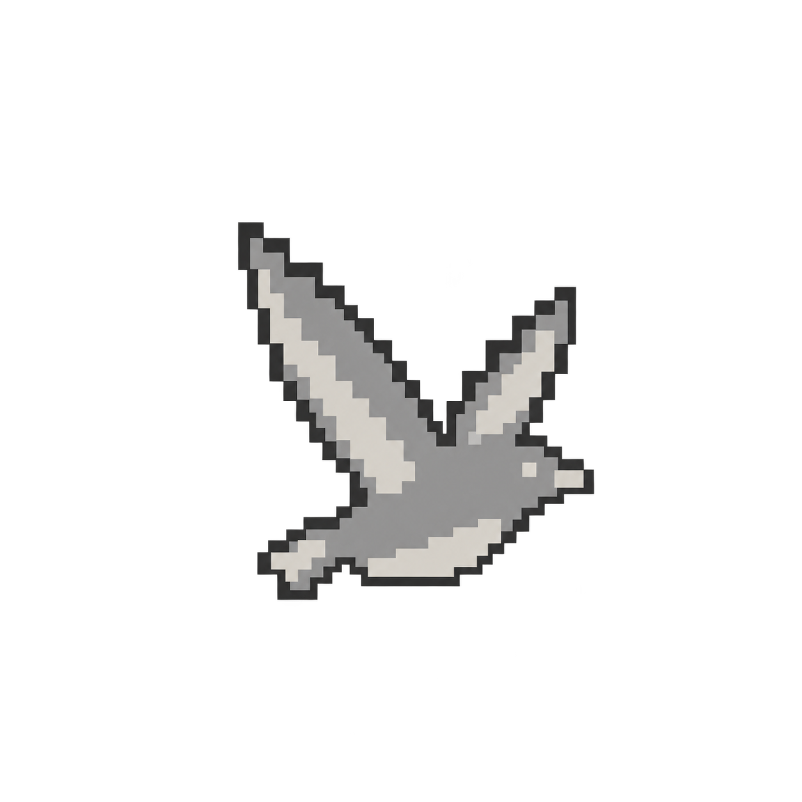
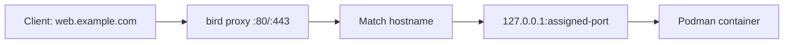

<p align="center">
  
</p>

<h1 align="center">Bird</h1>

<p align="center"><strong>Agent and human friendly containers as a service.</strong></p>

<p align="center">
  <a href="#quick-start">Quick start</a> ·
  <a href="#usage">Usage</a> ·
  <a href="#how-it-works">How it works</a> ·
  <a href="#development">Development</a>
</p>

> [!WARNING]
> **bird is a very, very experimental project.** Expect breaking changes, bugs and missing features. Use it to experiment with workloads and data you can lose, not in production.

bird is a self-hostable platform for deploying containerized apps, written in Rust. It runs containers with rootless Podman, keeps its state in SQLite and routes traffic through its own HTTP/HTTPS proxy.

- `birdd`: the daemon. It runs the API, the proxy, certificates and the machine supervisor.
- `bird`: the CLI.

## Design

- **Rust** because the daemon runs all the time and sits in the request path. Native binaries, no runtime, Tokio for I/O, and a proxy that streams bodies instead of buffering them.
- **Podman** runs containers as an unprivileged user under systemd, through its API on a local socket. Images come from Docker Hub, GHCR or your own registry.
- **SQLite** keeps state with no database server to run. `birdd` creates and migrates it on start.
- **A built-in proxy** takes its routes straight from deployments, so there are no config files to generate. It handles HTTPS with automatic certificates.

### Why not Firecracker microVMs yet?

[Firecracker](https://firecracker-microvm.github.io/) gives every workload its own kernel and a VM boundary. It also means managing kernels, root filesystems and VM networking. Podman already handles images, networks and logs without root. The tradeoff is that containers share the host kernel, so they don't isolate tenants the way microVMs do.

We plan a common runtime interface with adapters for Podman, Firecracker, [containerd](https://containerd.io/) and maybe others. **Only Podman works today.**

## Requirements

- Linux with Podman 5 or newer and its API socket on: `systemctl --user enable --now podman.socket`
- A Rust toolchain with edition 2024, to build from source.

## Quick start

```sh
cargo build --release
./target/release/birdd --data-dir ./data --proxy-addr 0.0.0.0:8080
```

The API listens on `127.0.0.1:7070` and the proxy on `0.0.0.0:8080` (`:80` by default). The daemon puts its database and an API token in `./data`. In another terminal:

```sh
./target/release/bird login 127.0.0.1:7070 < ./data/api-token
./target/release/bird deploy web docker.io/library/nginx:alpine --domain web.localhost
curl -H 'Host: web.localhost' http://127.0.0.1:8080
```

To run it as a service, use the systemd unit in [contrib/systemd/birdd.service](contrib/systemd/birdd.service). The install steps are at the top of the file. Binding ports 80 and 443 without root needs `net.ipv4.ip_unprivileged_port_start=80`.

## Usage

```sh
cd my-app
bird init                              # writes bird.toml, builds ./Dockerfile
bird deploy
bird status                            # machines, cpu, memory, domains, health
bird status -w                         # same, refreshed every 2s
bird logs -f
bird scale 3
bird restart                           # one machine at a time
bird stop                              # keeps everything, `bird start` brings it back
bird history
bird rollback                          # to the previous deployment, or pass an id
bird rm                                # asks first, --purge also deletes volumes

bird exec                              # a shell in a running machine
bird exec psql -U postgres             # an interactive psql prompt
bird run rails console                 # a fresh container, removed when you leave

bird ls                                # every service
bird deploy api ghcr.io/owner/api:1 --port 3000 --domain api.example.com
bird logs -s api                       # any service by name
```

Commands act on the service in `./bird.toml`, or the one you name with `-s <name>`. From a terminal, `exec` and `run` give you a real interactive shell. From scripts or with `-T`, they pass bytes through and exit with the command's exit code, so `bird exec pg_dump > app.dump` just works.

Read commands take `--json`. Destructive ones ask first unless you pass `-y`. Run `bird <command> --help` for every option.

### bird.toml

`bird init` writes a starter file. With one in the directory, `bird deploy` needs no arguments. Every field:

```toml
name = "api"                       # the service, required
project = "shop"                   # where it deploys, see Projects and environments
environment = "staging"

image = "ghcr.io/acme/api:1.4"     # the image to run, or use [build] below instead
port = 3000                        # what the app listens on
domains = ["api.example.com", "www.example.com"]
command = ["bin/server", "--workers", "4"]   # instead of the image's own command

health = "/healthz"                # "http", "tcp" or a path that must answer 2xx
health_timeout = "2m"              # how long a new machine has to pass it
memory = "512m"                    # per machine, like "512m" or "2g"
cpus = 0.5                         # per machine, in cores
replicas = 2                       # machines to run

volumes = [{ name = "data", path = "/var/lib/app" }]

# [build]                          # or build from source, without an image line
# context = "."                    # relative to bird.toml
# dockerfile = "Dockerfile"
# args = { NODE_ENV = "production" }   # Dockerfile ARGs, readable in the image

[env]
DATABASE_URL = "${{postgres.DATABASE_URL}}"
LOG_LEVEL = "info"

[backup]                           # back up the volumes on a schedule
every = "1d"
keep = 7

[[cron]]                           # a command on a schedule, in UTC
name = "report"
schedule = "0 6 * * MON"           # 6:00 every Monday
command = ["bin/report", "--weekly"]
timeout = "30m"                    # stopped after this, default 1h

[[cron]]
name = "cleanup"
schedule = "@hourly"
command = ["bin/cleanup"]
```

| Field | Default | Notes |
| --- | --- | --- |
| `name` | required | Lowercase letters, digits and `-`, starting with a letter. |
| `project`, `environment` | your `bird switch`, else `default`/`production` | `-p` and `-E` win over them. |
| `image` | none | Use either `image` or `[build]`, not both. |
| `port` | `80` | The app must listen on `0.0.0.0`. |
| `domains` | none | Only added. Deploying never removes domains set elsewhere. |
| `command` | the image's | Kept for later deploys. `bird deploy --default-command` goes back to the image's. |
| `health` | `"http"` (any answer on `/`) | `"tcp"` only waits for the port to accept connections. |
| `health_timeout` | `60s` | `"90s"`, `"2m"` or a number of seconds, up to an hour. |
| `memory` | `1g` | 32 MiB to 256 GiB. |
| `cpus` | `1` | 0.1 to 64. |
| `replicas` | `1` | Up to 32. A service with volumes runs exactly one. |
| `volumes` | none | Kept across deploys. Only `bird rm --purge` deletes them. |
| `[build]` | none | `context` defaults to the file's directory, `dockerfile` to `Dockerfile`. `.dockerignore` is honored. |
| `[env]` | none | Only added. Keep secrets out of the file and set them with `bird env set`. |
| `[backup]` | none | `every` from `1h` to `30d`. `keep` from 1 to 1000, default 7. |
| `[[cron]]` | none | The file's jobs replace the service's once a deploy works. Deploys without the file keep them. |

One file is one service. Flags win over the file, and flags you can repeat, like `--domain`, add to its lists. Unknown fields are errors, so typos fail instead of being ignored.

### Cron jobs

```sh
bird cron                              # jobs with their next and last run
bird cron run report                   # run one now, prints its output
bird cron runs report                  # recent runs
bird cron output report                # what the latest run printed
```

Each run is a fresh container from the service's image with its variables, like `bird run`. A job never overlaps itself, and a stopped service skips its runs. Times missed while birdd was down are not made up.

### Variables

```sh
bird env set API_KEY='${{secret}}' DATABASE_URL='${{postgres.DATABASE_URL}}'
bird env                               # names only
bird env get DATABASE_URL
bird env unset OLD_KEY
```

`${{service.KEY}}` reads another service's variable and `${{secret}}` generates a random one, once. Changing variables redeploys the service unless you pass `--no-deploy`.

### Templates

```sh
bird templates                         # postgres, valkey
bird add postgres
bird env set -s app DATABASE_URL='${{postgres.DATABASE_URL}}'
```

A template gives you a ready service with a volume, a generated password and a connection string.

### Projects and environments

```sh
bird project create shop
bird environment create staging -p shop
bird deploy -p shop -E staging
bird switch shop staging               # work there by default from now on
```

Each environment has its own services, variables and private network. Staging can't reach production, even by IP.

### Volumes

```sh
bird deploy db docker.io/library/postgres:18 --port 5432 --health tcp -v data:/var/lib/postgresql
```

A service with a volume runs one machine. A volume remembers which image wrote it, and bird refuses a different one (like postgres 17 to 18) unless you pass `--allow-image-change`.

### Backups

```sh
bird backup create -s db
bird backup -s db                      # list
bird backup restore -s db <backup-id>
bird backup schedule -s db --every 1d --keep 7
```

A backup pauses the service for the few seconds the copy takes. Restoring saves the current data as a backup first, so you can always undo it. Backups go to `~/.local/share/bird/backups`, or to any S3-compatible bucket with `--s3-bucket`, and they survive `bird rm --purge`.

birdd also copies its own `bird.db` once a day and keeps a week of copies. To recover, stop birdd, copy the newest `database/bird-<time>.db` over `bird.db`, delete `bird.db-wal` and `bird.db-shm`, and start it again.

### Users and orgs

```sh
bird user create alice > alice.token   # prints her first token
bird org create team
bird org add team alice --role admin
```

The token in birdd's data dir is `root` and always works. Orgs own projects, and their members can only see their org's projects.

### Private registries

```sh
echo "$TOKEN" | bird registry login ghcr.io --username me
```

### HTTPS

```sh
birdd --acme-directory https://acme-v02.api.letsencrypt.org/directory --acme-email you@example.com
```

bird gets and renews a certificate for every domain and redirects HTTP to HTTPS once one exists. Point DNS at the server first. `*.localhost` domains never get certificates.

## How it works

### Deployments

When you run `bird deploy`, birdd:

1. Saves the service settings.
2. Pulls or builds the image and starts new machines on the environment's network.
3. Waits up to 60 seconds for them to pass a health check. By default that's any HTTP answer on `/`.
4. Moves traffic to the new machines and removes the old ones.

If the new machines never get healthy, traffic stays on the old deployment. Your app has to listen on `0.0.0.0` on its port (`80` unless you set `--port`). Services find each other by name, like `postgres` or `postgres.internal`.

### Routing

The proxy matches the hostname to a service domain and spreads requests across its machines. Bodies stream, websockets work, and your app gets the usual `X-Forwarded-*` headers.



Adding a domain doesn't create DNS records. Until DNS exists, test with `curl -H 'Host: web.example.com' http://127.0.0.1/`.

| Proxy response | Meaning                                         |
| -------------- | ----------------------------------------------- |
| `400`          | Missing or bad hostname.                        |
| `404`          | No service has this domain.                     |
| `413`          | The request body is over 100 MB.                |
| `502`          | The proxy couldn't reach the app.               |
| `503`          | The service has no running machine right now.   |
| `504`          | The app took over 60 seconds to start replying. |

### Supervision

Every 10 seconds the supervisor checks each machine. It restarts stopped ones and replaces machines that fail three checks in a row. It also cleans up old images, keeping a few per service for rollbacks.

## Development

```sh
cargo fmt --check
cargo clippy --all-targets -- -D warnings
cargo test -- --include-ignored        # ignored tests need the Podman socket
```

`birdd` serves API docs at `/docs` and the OpenAPI spec at `/v1/openapi.json`.

## License

[Apache License 2.0](LICENSE).
