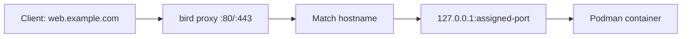

<p align="center">
  
</p>

<h1 align="center">Bird</h1>

<p align="center"><strong>Agent and human friendly containers as a service.</strong></p>

<p align="center">
  <a href="#quick-start">Quick start</a> ·
  <a href="#usage">Usage</a> ·
  <a href="#how-it-works">How it works</a> ·
  <a href="#development">Development</a>
</p>

> [!WARNING]
> **bird is a very, very experimental project.** Expect breaking changes, bugs, and incomplete features. Use it for experimentation with disposable workloads and data, not production deployments.

A self-hostable platform for deploying containerized apps, written in Rust. bird runs containers with rootless Podman, keeps state in SQLite, and routes traffic through its own HTTP/HTTPS proxy.

- `birdd`: the daemon, HTTP API, proxy, certificate manager and machine supervisor.
- `bird`: the CLI.

## Design

- **Rust** for a long-running daemon on the hot path: native binaries, no runtime, Tokio for I/O, and a proxy that streams bodies instead of buffering them.
- **Podman** runs containers as an unprivileged user under systemd, through its native API on a local socket. bird pulls standard images from Docker Hub, GHCR or private registries.
- **SQLite** holds state without a database server to run; `birdd` creates and migrates it on start.
- **A built-in proxy** updates its routes directly from deployments, with no config files to generate for another server. It handles HTTPS with automatic certificates.

### Why not Firecracker microVMs yet?

[Firecracker](https://firecracker-microvm.github.io/) gives each workload its own guest kernel and a VM isolation boundary, but integrating it means managing kernels, root filesystems and VM networking. Podman already handles images, containers, networks and logs rootless. Containers share the host kernel, so they do not isolate tenants like microVMs do.

We plan a common runtime interface with adapters for Podman, Firecracker, [containerd](https://containerd.io/) and possibly others. **Only Podman is supported today.**

## Requirements

- Linux with Podman 5 or newer and its API socket enabled: `systemctl --user enable --now podman.socket`
- A Rust toolchain supporting edition 2024, to build from source.

## Quick start

```sh
cargo build --release
./target/release/birdd --data-dir ./data --proxy-addr 0.0.0.0:8080
```

The API listens on `127.0.0.1:7070` and the proxy on `0.0.0.0:8080` (default `:80`). The daemon creates its database and an API token in `./data` (default `~/.local/share/bird`). In another terminal:

```sh
./target/release/bird login 127.0.0.1:7070 < ./data/api-token
./target/release/bird deploy web docker.io/library/nginx:alpine --domain web.localhost
curl -H 'Host: web.localhost' http://127.0.0.1:8080
```

To run it as a service, use the rootless systemd unit in [contrib/systemd/birdd.service](contrib/systemd/birdd.service); install steps are in its header. Binding ports 80 and 443 rootless needs `net.ipv4.ip_unprivileged_port_start=80`.

## Usage

```sh
cd my-app
bird init                              # bird.toml named after the directory, builds ./Dockerfile
bird deploy
bird status                            # deployment, machines, domains, health
bird logs -f
bird scale 3
bird restart                           # one machine at a time, each waits to be healthy
bird stop                              # keeps machines, data and settings; `bird start` resumes
bird history
bird rollback                          # previous deployment, or pass an id
bird rm                                # asks first; --purge also deletes its volumes

bird exec psql -U postgres             # a command in a running machine
bird run rake db:migrate               # a command in a fresh container from the service's image

bird ls                                # every service
bird deploy api ghcr.io/owner/api:1 --port 3000 --domain api.example.com
bird logs -s api                       # any service by name
```

Commands act on the service named in `./bird.toml`, or the one given with `-s <name>` (put it before the command for `exec` and `run`, everything after belongs to the command). `bird exec` and `bird run` stream the command's output and exit with its exit code; `run` gets the service's variables and private network but no volumes, and its container is removed when the command ends or you disconnect. Neither is interactive yet. Read commands take `--json` for scripts, destructive ones ask for confirmation unless you pass `-y`, and `bird completions <shell>` prints shell completions. Run `bird --help` or `bird <command> --help` for every option.

### bird.toml

`bird init` writes a starter file that builds the directory's Dockerfile on the port it `EXPOSE`s; `bird init web nginx:alpine` runs an image instead. With a `bird.toml` in the directory, `bird deploy` needs no arguments:

```toml
name = "web"
port = 3000
domains = ["web.example.com"]
memory = "512m"
cpus = 0.5
replicas = 2
health = "/healthz"
health_timeout = "2m"

[build]
context = "."
dockerfile = "Dockerfile"
args = { NODE_ENV = "production" }

[env]
DATABASE_URL = "${{postgres.DATABASE_URL}}"
```

One file describes one service. Use `image = "..."` instead of `[build]` to deploy a published image. Flags override the file and repeatable flags add to it. Deploying never removes variables or domains set elsewhere. Keep secrets out of the file and set them with `bird env set`; build args stay readable in the image.

### Variables

```sh
bird env set API_KEY='${{secret}}' DATABASE_URL='${{postgres.DATABASE_URL}}'
bird env                               # names only
bird env get DATABASE_URL --deployed
bird env unset OLD_KEY
```

Values can reference another service's variable (`${{service.KEY}}`), the same service's (`${{KEY}}`), or generate a random secret once (`${{secret}}`, `${{secret(N)}}`). References resolve when a deploy starts. Changing variables redeploys the service unless you pass `--no-deploy`.

### Templates

```sh
bird templates                         # postgres, valkey
bird add postgres                      # or `bird add postgres db` to pick the name
bird env set -s app DATABASE_URL='${{postgres.DATABASE_URL}}'
```

Templates create ready-made services with a volume, a generated password and a connection variable.

### Volumes

```sh
bird deploy db docker.io/library/postgres:18 --port 5432 --health tcp -v data:/var/lib/postgresql
```

A service with volumes runs one machine and stops the old one before starting the new one. A volume remembers the image family that first used it, and bird refuses a different one (such as postgres 17 → 18) unless you pass `--allow-image-change`.

### Backups

```sh
bird backup create -s db               # copies every volume of the service
bird backup -s db                      # lists them
bird backup restore -s db <backup-id>
bird backup rm -s db <backup-id>
```

A backup pauses the service's machines for the few seconds the copy takes, so the data is consistent the way it would be after a crash, which databases recover from. Restoring first saves the current data as a new backup, so you can undo it, then restarts the service on the restored data. Backups are kept in `~/.local/share/bird/backups` (`--backup-dir` to change it) and survive `bird rm --purge`. A recreated service generates new secrets, but restored database data keeps its old passwords: note them with `bird env get` before removing a service, and set them on the new one.

### Private registries

```sh
echo "$TOKEN" | bird registry login ghcr.io --username me
```

### HTTPS

```sh
birdd --acme-directory https://acme-v02.api.letsencrypt.org/directory --acme-email you@example.com
```

With ACME enabled, bird gets and renews certificates for every domain, serves HTTPS on `:443`, and redirects HTTP to HTTPS once a domain has a certificate. Point DNS at the server first; `*.localhost` domains never get certificates.

## How it works

### Deployments

When you run `bird deploy`, the daemon:

1. Saves the service settings in SQLite.
2. Pulls the image (or uses the one it just built) and starts the new machines on the `bird` network, with Podman's init as PID 1.
3. Waits up to 60 seconds (`--health-timeout`) for each machine to pass its health check: by default any HTTP response on `/`; with `--health /healthz`, a 2xx on that path; with `--health tcp`, an accepted connection. Probes send `Host: localhost`.
4. Switches the proxy routes to the new machines and removes the old ones.

If startup fails, traffic stays on the previous deployment and its settings are restored. The app must listen on `0.0.0.0` on the port given by `--port` (default `80`).

Services reach each other by name on the private network (`postgres` or `postgres.internal`), without going through the proxy.

### Routing

The proxy matches the request's hostname (case-insensitive, without the port) to a service domain and forwards it round-robin to that service's running machines. Paths and query strings pass through unchanged. Bodies are streamed, websockets are tunnelled, and the app receives `X-Forwarded-For`, `X-Forwarded-Host` and `X-Forwarded-Proto`. A response that stops sending data for 60 seconds is cut off. Every response carries `x-server: Bird`.



Registering a domain does not create DNS records; point them at the server. Before DNS exists, test with `curl -H 'Host: web.example.com' http://127.0.0.1/`.

| Proxy response | Meaning                                                           |
| -------------- | ----------------------------------------------------------------- |
| `400`          | Missing or invalid hostname or request target.                    |
| `404`          | The hostname has no registered route.                             |
| `413`          | The request body is over 100 MB.                                  |
| `502`          | The proxy could not reach the app.                                |
| `503`          | The hostname is registered, but no running machine is available.  |
| `504`          | The app took over 60 seconds to start responding.                 |

### Supervision

Every 10 seconds the supervisor checks each machine with the same health check. It restarts stopped containers and replaces missing ones or ones that fail three checks in a row, retrying failures with increasing delays. It also removes orphaned containers and refreshes the routes. After each deploy, bird deletes old images, keeping the last few per service for rollbacks. The CLI currently uses the `default` project and `production` environment.

## Development

```sh
cargo fmt --check
cargo clippy --all-targets -- -D warnings
cargo test -- --include-ignored        # ignored tests need the Podman socket
```

`birdd` serves API docs at `/docs` and the OpenAPI spec at `/v1/openapi.json`.

## License

[Apache License 2.0](LICENSE).
